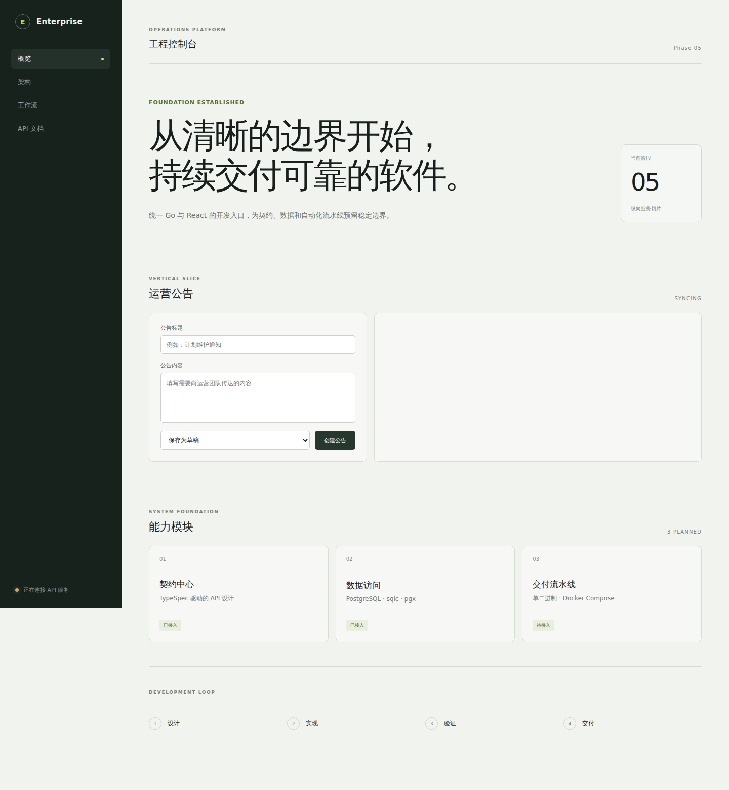

# 本地开发指南

## 环境要求

- Go 1.27 或更高版本；
- Node.js 24.21 或更高版本；
- pnpm 10；
- Docker Engine 与 Docker Compose v2（数据库相关命令需要）；

仓库在根 `package.json` 中固定 pnpm 版本。推荐通过 Corepack 使用对应版本，避免 lockfile 因工具版本不同而产生无关变更。

## 安装与启动

```bash
cp .env.example .env
pnpm install
pnpm db:up
pnpm db:migrate
pnpm dev
```

`pnpm dev` 会并行启动：

- Go API：`http://127.0.0.1:8080`；
- Vite Web：`http://127.0.0.1:5173`；
- 健康检查：`http://127.0.0.1:5173/api/healthz`。

Vite 在开发环境将 `/api` 代理到 Go 服务，因此浏览器请求保持同源，不需要开发态 CORS 配置。可通过 `HTTP_ADDRESS` 修改 Go 服务监听地址。



## 统一命令

| 命令 | 用途 |
| --- | --- |
| `pnpm dev` | 并行启动 Go 和 Web 开发服务 |
| `pnpm test` | 运行 Go 和 Web 测试 |
| `pnpm check` | 运行生成漂移、格式、Go、SQL、Web 与 Shell 静态检查 |
| `pnpm format` | 统一格式化 Go、TypeSpec 与 Web 源文件 |
| `pnpm build` | 构建 Web，并将其嵌入输出到 `dist/server` 的 Go 二进制 |
| `pnpm test:race` | 使用 Go race detector 运行后端测试 |
| `pnpm test:embed` | 使用生产 build tag 验证前端 embed 与 SPA fallback |
| `pnpm dev:server` | 只启动 Go 服务 |
| `pnpm dev:web` | 只启动 Web 服务 |
| `pnpm db:up` | 启动本地 PostgreSQL 并等待健康检查通过 |
| `pnpm db:migrate` | 执行全部待处理 migration |
| `pnpm db:status` | 查看数据库 migration 状态 |
| `pnpm db:down` | 停止本地 PostgreSQL |
| `pnpm test:database` | 在临时 Compose 数据库中验证 migration 往返 |

根命令是本地与 CI 的公共入口。子项目可以保留自己的具体命令，但 CI 不应复制内部实现。

## 当前边界

当前基础交付方案有意不包含以下能力：

- 身份认证、权限模型和生产密钥管理；
- Kubernetes、多区域或高可用数据库编排；
- 自动化数据库备份调度和异地存储；
- 指标、链路追踪、告警和集中日志平台。

这些能力需要结合实际组织基础设施单独设计，不应由通用脚手架预设供应商或安全边界。
